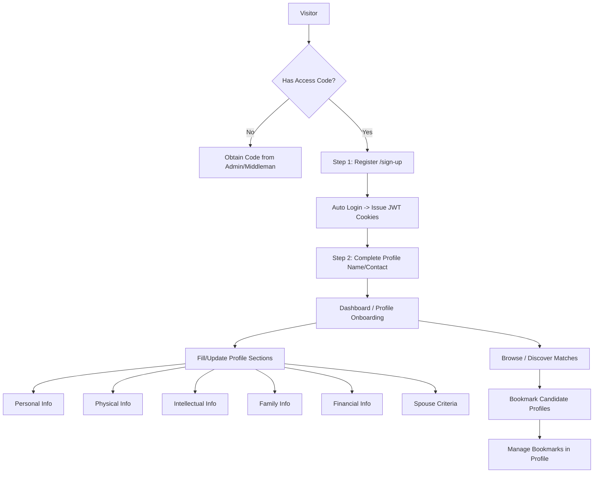

# Project Overview & Technical Guide (`agy.md`)

> **Antigravity (AGY) Master Reference Document**  
> *Comprehensive project manual, domain guide, API reference, architecture blueprint, and development conventions.*

---

## 1. Executive Summary & Domain Concept

This project is an **advanced, culturally-attuned dating and matrimonial matchmaking platform**. Unlike standard casual dating apps, this platform is tailored for serious matchmaking and marriage with comprehensive multi-dimensional compatibility profiling (cultural, religious, intellectual, physical, family background, and financial criteria).

### Key Product Pillars
1. **Access-Code Gated Registration**: Registration requires a validated invitation/access code (`access_code`) to ensure a trusted, high-quality user network.
2. **Two-Step Registration & Deep Profile Onboarding**:
   - **Step 1 (Basic Signup)**: Minimal credentials (`username`, `email`, `phone_number`, `access_code`, `password`, optional `middle_man_code`).
   - **Step 2 (Profile Completion)**: Detailed profile sections capturing rich personality, physical characteristics, family structure, intellectual and religious viewpoints, financial status, and preferred spouse criteria.
3. **Modular Profile Management**: Every profile section (Personal, Physical, Intellectual, Family, Financial, Spouse Preferences, Account, Security) is isolated into its own dedicated sub-page with independent save/update controls.
4. **Bookmark & Saved Matches**: Users can bookmark candidate profiles and manage saved matches via a dedicated bookmarks area.
5. **Decoupled Architecture**: Strict separation between the backend (Django REST Framework) and the frontend (Next.js 16 + React 19 + TailAdmin dashboard).

---

## 2. System Architecture & Tech Stack

```
┌────────────────────────────────────────────────────────┐
│             Frontend (Next.js 16 / React 19)           │
│  - App Router: (with-layouts) & (without-layouts)      │
│  - UI: TailAdmin /     tailadmin + Tailwind CSS v4     │
│  - Primitives: React Aria Components + @tailgrids/core │
│  - State & Query: TanStack React Query v5              │
└──────────────────────────┬─────────────────────────────┘
                           │ HTTP REST (JSON)
                           │ credentials: 'include' (HTTP-Only JWT Cookies)
                           ▼
┌────────────────────────────────────────────────────────┐
│             Backend (Django 4.2 / DRF 3.15)            │
│  - Base URL: http://localhost:8000                     │
│  - Swagger UI: /api/swagger-ui/                        │
│  - OpenAPI Schema: /api/schema/                        │
│  - Auth: SimpleJWT (HTTP-Only Cookies)                 │
│  - Database: PostgreSQL (psycopg2-binary)              │
│  - Features: django-jalali-date, django-filter,        │
│              django-phonenumber-field, sentry-sdk      │
└────────────────────────────────────────────────────────┘
```

### 2.1. Backend Technology Stack
- **Framework**: Django `4.2.20`, Django REST Framework `3.15.2`
- **Authentication**: `djangorestframework-simplejwt` `5.3.1`, `PyJWT` `2.10.1` (transmitting `access_token` and `refresh_token` via **HTTP-only cookies**)
- **API Documentation**: `drf-spectacular` `0.28.0` (Swagger UI at `http://localhost:8000/api/swagger-ui/`)
- **Database & Driver**: PostgreSQL with `psycopg2-binary` `2.9.10`
- **Persian Calendar / Date Handling**: `django-jalali-date` `1.1.3`
- **Phone Number Validation**: `django-phonenumber-field` `8.0.0`, `phonenumbers` `8.13.52`
- **Filters & Fields**: `django-filter` `23.5`, `django-multiselectfield` `0.1.13`, `django-admin-multi-select-filter` `1.4.1`
- **CORS & Utilities**: `django-cors-headers` `4.4.0`, `django-extensions` `3.2.3`, `django_debug_toolbar` `3.8.1`, `asgiref` `3.8.1`, `sqlparse` `0.5.3`
- **Production & Monitoring**: `gunicorn` `20.1.0`, `sentry-sdk` `2.25.1`, `python-dotenv[cli]` `0.21.1`
- **Testing**: `pytest` `8.3.5`, `pytest-django` `4.11.1`

### 2.2. Frontend Technology Stack
- **Framework**: Next.js `16.2.7` (App Router), React `19.2.4`, TypeScript `5`
- **CSS / Styling**: Tailwind CSS `v4` (`@tailwindcss/postcss`, `@tailwindcss/forms`), CSS custom properties / semantic tokens in `src/app/globals.css`
- **UI System**: TailAdmin / NextAdmin Pro design system (`src/components/tailgrids/core/`)
- **Accessibility & Components**: `react-aria-components` `^1.19.0`, `@base-ui/react`, `@floating-ui/react`, `@dnd-kit/react`
- **Data Fetching & Server State**: `@tanstack/react-query` `^5.101.2`, custom `apiClient` (`src/services/api/client.ts`)
- **Data Display & Visuals**: `@tanstack/react-table` `^8.21.3`, `recharts` `^3.8.1`, `date-fns` `^4.4.0`, `embla-carousel-react` `^8.6.0`, `leaflet` `^1.9.4`, `react-leaflet` `^5.0.0-rc.2`, FullCalendar (`@fullcalendar/*`)
- **Feedback & Notifications**: `sonner` `^2.0.7` (`toast.success()`, `toast.error()`)
- **Icons**: `@tailgrids/icons` `^2.0.0` and feature-specific `icons.tsx`

---

## 3. Core Domain Models & Schemas

The application models a comprehensive set of matrimonial and personal dimensions.

### 3.1. Authentication & User Management
| Schema / Model | Endpoints | Key Fields |
|---|---|---|
| **UserRegistration** | `POST /api/auth/register/` | `username`, `email`, `phone_number`, `access_code`, `password`, `password2`, `middle_man_code` |
| **Login** | `POST /api/auth/login/` | `username`, `password` (Returns user info; sets HTTP-only cookies) |
| **Logout** | `POST /api/auth/logout/` | Blacklists refresh token and deletes cookies |
| **Token Refresh** | `POST /api/auth/refresh/` | Rotates refresh token and renews auth cookies |
| **User Profile / Me** | `GET /api/auth/me/`, `PATCH /api/auth/me/` | `id`, `username`, `first_name`, `last_name`, `email`, `phone_number`, `middle_man_code`, `old_password`, `new_password` |
| **Complete Profile** | `PATCH /api/auth/complete-profile/` | `first_name`, `last_name`, `middle_man_code`, `phone_number`, `email` |
| **Access Code** | `GET, POST /api/access-codes/`, `GET, PATCH, DELETE /api/access-codes/{id}/` | `code`, `is_used`, `created_at`, `used_by` |

### 3.2. Personal & Identity Profile
- **Personal Information** (`/api/personal-information/`):
  `gender`, `sadat`, `birth_date`, `birth_location`, `education`, `degree`, `military_status`, `military_status_explanation`, `income`, `deposit`, `have_insurance`, `insurance_type`, `insurance_years`, `leisure_type`, `usage_cases`, `usage_case_description`, `tatoo`, `tatto_description`, `conviction_or_arrest_history`, `conviction_reason`
- **Identity Information** (`/api/identity-information/`):
  Identity verification details, national ID, nationality, status.
- **Birth Certificate Information** (`/api/birth-certificate-information/`):
  Birth certificate records, registration place, official registration details.
- **Introduced Subjects Information** (`/api/introduced-subjects-information/`):
  Introducer / middleman records and matching context.

### 3.3. Physical Characteristics & Health
- **Physical Information** (`/api/physical-information/`):
  `height`, `weight`, `skin_color`, `eyes_color`, `blood_type`, `character_and_temperament`, `glasses`, `glasses_size`, `body_and_face`, `disease_or_surgery`, `medication_surgery_disease_type`

### 3.4. Intellectual, Religious & Lifestyle Dimensions
- **Intellectual Information** (`/api/intellectual-information/`):
  `marriage_goals`, `opinion_woman_job`, `opinion_woman_edu`, `pros_of_yourself`, `cons_of_yourself`, `type_connection_friends`, `friends_connection_reason`, `political_orientation`, `opinion_velayat_faqih`, `opinion_child_quantity`, `contract_how`, `wedding_how`, `worship_prayer`, `fasting`, `fasting_explanation`, `cover_type_house`, `cover_type_society`, `participating_prayer_quran_meetings`, `music`, `dance_singing_assemblies`, `opinion_innocent_contact`, `cover_type_innocent_contact`, `decision_making_choosing_spouse`

### 3.5. Family Background & Relatives
- **Family Information** (`/api/family-information/`):
  `average_family_education`, `average_family_finance`, `family_divorce_history`, `family_divorce_reason`, `contact_with_family`, `contact_with_relatives`, `number_of_sisters`, `number_of_brothers`
- **Specific Family Members**:
  - `Father` (`/api/fathers/`) & `Mother` (`/api/mothers/`): Age, job, education, living status.
  - `Brothers` (`/api/brothers/`) & `Sisters` (`/api/sisters/`): Age, marital status, job, education.
  - `Grooms` (`/api/grooms/`) & `Brides or Wives` (`/api/bride-or-wife/`): In-law details.

### 3.6. Financial, Housing & Marital Status
- **Financial Information** (`/api/financial-information/`):
  `job`, `current_residence_status`, `ownership_status`, `rent_amount`, `mortgage_amount`, `capital`, `other_captial`, `after_marriage_residence_status`, `ex_spouse_financial_status`, `ex_spouse_financial_pay_status`, `ex_spouse_financial_amount`, `dowry_type`, `dowry_amount`, `jahiziyeh`, `jahiziyeh_explantion`
- **Marital History**:
  - `EngagementOrWeddingStatus` (`/api/engagement-or-wedding-status/`): Prior engagements or marriages.
  - `ExHusbandChildStatus` (`/api/ex-husband-child-status/`): Prior children, custody, gender, age.

### 3.7. Preferred Spouse (Expectations & Criteria)
- **Preferred Wife / Spouse Personal Info** (`/api/preferred-wife-personal-information/`):
  `education`, `field_of_study`, `future_spouse_job`, `current_residence_location`, `after_marriage_residence_location`
- **Preferred Wife / Spouse Physical Info** (`/api/preferred-wife-physical-information/`):
  `height`, `weight`, `skin_color`
- **Preferred Wife / Spouse Intellectual Info** (`/api/preferred-wife-intellectual-information/`):
  `appearance_type`, `age_difference`, `future_spouse_family_religious_status_importance`, `future_spouse_family_financial_status_importance`, `marriage_with_someone_with_marriage_experience`, `additional_explnation_marriage_with_someone`, `most_important_moral_feature_of_future_spouse`, `marriage_with_disabled`, `marriage_with_veteran`, `marriage_with_veteran_disabled_explanation`, `red_flags`
- **Future Spouse Originality** (`/api/future-spouse-originality/`) & **Extra Preferences** (`/api/preferred-wife-extra-information/`)

---

## 4. User Stories & Application Flows



### Flow 1: Gated Registration (Signup)
1. **Route**: `/sign-up`
2. **Access Codes**: Single-use UUID tokens generated via Django Admin or `/api/access-codes/`. Once submitted in Step 1, the code is consumed by `UserManager.create_user` and cannot be reused.
3. **Step 1 (Account & Access Code)**: User inputs `access_code`, `username`, `email`, `phone_number`, `password`, `password2`, optional `middle_man_code`. On submit, calls `POST /api/auth/register/`. Upon successful creation (201), the frontend immediately invokes `POST /api/auth/login/` to set the session cookies and advances to Step 2.
4. **Step 2 (Personal Profile Details)**: User inputs `first_name` and `last_name`, which is submitted via `PATCH /api/auth/complete-profile/`.
5. **Transition**: Redirects user to `/profile/account` or the dashboard.

### Flow 2: Cookie-Based JWT Login & Session Flow
1. **Route**: `/sign-in`
2. Calls `POST /api/auth/login/` with `username` and `password`.
3. Backend returns the `User` object in JSON and sets two HTTP-only cookies:
   - `access_token`
   - `refresh_token`
4. Client stores user state in `AuthContext` (`src/hooks/use-auth.tsx`).
5. On subsequent API calls, browser automatically passes cookies with `credentials: 'include'`.
6. On HTTP `401 Unauthorized`, `apiClient` automatically triggers `POST /api/auth/refresh/` once and transparently retries the failed request.
7. Logout via `POST /api/auth/logout/` blacklists the refresh token and clears auth cookies.

### Flow 3: Forgot Password & Password Recovery
1. **Route**: `/forgot-password`
2. User provides email/phone to initiate password reset instructions.
3. Authenticated password change handled under `/profile/security` via `PATCH /api/auth/me/` with `old_password` and `new_password`.

### Flow 4: Modular Profile Settings
1. **Route Hierarchy**:
   - `/profile/account`: Core profile (first/last name, email, phone, middleman code).
   - `/profile/personal`: Gender, Sadat status, birth date, education, military status, insurance, hobbies.
   - `/profile/physical`: Height, weight, skin/eye color, build, medical history.
   - `/profile/intellectual`: Beliefs, prayer/fasting habits, lifestyle, social views, marriage goals.
   - `/profile/family`: Family education, financial status, parents, brothers, sisters, in-laws.
   - `/profile/financial`: Employment, housing, rent/mortgage, dowry/mehriyeh, jahiziyeh.
   - `/profile/preferences`: Criteria for future spouse (personal, physical, intellectual, red flags).
   - `/profile/security`: Password changes and security settings.
   - `/profile/notification`: Alerts and communication preferences.
2. **Isolated Persistence**: Each section loads its data independently, validates fields locally, and submits changes to its dedicated endpoint with granular toast feedback.

### Flow 5: Bookmarking & Saved Matches
1. Users can bookmark candidate profiles when viewing profile cards or match lists.
2. A dedicated **Bookmarks** view (`/profile/bookmarks` or `/bookmarks`) lists saved candidates, allows quick filtering, and enables un-bookmarking / direct interaction.

---

## 5. Frontend Architecture & Folder Conventions

```
src/
├── app/
│   ├── (with-layouts)/                # Shared shell layout with Sidebar & Header
│   │   ├── (dashboard)/               # Dashboard overview & analytics
│   │   │   └── (home)/
│   │   ├── profile/                   # Modular Profile Management
│   │   │   ├── account/               # Account & basic contact details
│   │   │   ├── personal/              # Personal & identity info
│   │   │   ├── physical/              # Physical traits & health
│   │   │   ├── intellectual/          # Intellectual, religious & social views
│   │   │   ├── family/                # Family background & members (planned)
│   │   │   ├── financial/             # Financial & housing details (planned)
│   │   │   ├── preferences/           # Spouse criteria & expectations (planned)
│   │   │   ├── bookmarks/             # Saved candidates / bookmarks (planned)
│   │   │   ├── security/              # Password change & active sessions
│   │   │   ├── notification/          # Notification preferences
│   │   │   ├── layout.tsx             # Profile secondary sidebar/tab layout
│   │   │   └── data.tsx               # Profile navigation tab definitions
│   │   ├── charts/                    # Chart views
│   │   ├── tables/                    # Data tables
│   │   └── ui-elements/               # Design system preview components
│   ├── (without-layouts)/             # Fullscreen auth & onboarding routes
│   │   ├── sign-in/                   # Login page
│   │   ├── sign-up/                   # Registration page
│   │   └── forgot-password/           # Password recovery
│   ├── css/                           # Global stylesheets & FullCalendar overrides
│   ├── globals.css                    # Tailwind CSS v4 tokens & color variables
│   ├── layout.tsx                     # Root HTML & SSR layout
│   └── providers.tsx                  # Global providers (React Query, Theme, Auth, Toaster)
├── components/
│   ├── tailgrids/core/                # Design-system primitives (Button, Card, TextField, etc.)
│   └── common/                        # Global app chrome (Header, Sidebar, UserMenu)
├── hooks/
│   ├── use-auth.tsx                   # AuthContext & login/logout state management
│   └── use-media-query.ts             # Responsive viewport helper
├── services/
│   └── api/
│       ├── client.ts                  # Fetch client wrapper with auto-refresh & cookie support
│       ├── auth.ts                    # Auth API endpoints (register, login, me, refresh)
│       └── profile.ts                 # Profile section CRUD API endpoints
├── types/                             # Shared TypeScript interfaces & declarations
└── utils/                             # Styling utilities (cn, clsx, tailwind-merge)
```

---

## 6. Coding & Implementation Rules for AGY

### 6.1. Architectural & File Rules
1. **Never place backend code in frontend**: The backend is completely external (`http://localhost:8000`). All interactions must use HTTP requests via `src/services/api/`.
2. **Route Grouping**:
   - Auth and standalone screens go to `src/app/(without-layouts)/`.
   - All dashboard, profile, and application screens go to `src/app/(with-layouts)/`.
3. **Modular Sub-Components**: Never create massive monolithic single-file components. Break complex screens into dedicated sub-components (`header.tsx`, `filter-bar.tsx`, `form-step.tsx`, `card-item.tsx`).
4. **Composition & Typed Contracts**: Always export strong TypeScript interfaces for props and avoid inline helper render functions (`renderStep()`).

### 6.2. Styling & Design Token Rules
1. **No Hardcoded Hex Colors**: Use Tailwind CSS semantic tokens defined in `src/app/globals.css` (e.g., `text-text-primary`, `bg-card-background`, `border-card-border`, `bg-background-gray-secondary_alt`).
2. **No Custom Utility Classes**: Do not create arbitrary utility classes in CSS files.
3. **Primitives First**: Always prefer `@/components/tailgrids/core/` primitives (`Button`, `Card`, `TextField`, `Label`, `Input`, `Select`, `Tabs`, `Badge`, `Dialog`) before writing custom elements.

### 6.3. API & Data Fetching Rules
1. **HTTP-Only Cookie Authentication**: Never attempt to manually store JWT tokens in `localStorage` or JavaScript state. Rely on `credentials: 'include'`.
2. **Error Handling & User Feedback**: Always handle errors via `try / catch` with `sonner` `toast.error(error.message)` and `toast.success(message)`.
3. **TanStack React Query**: Use React Query hooks (`useQuery`, `useMutation`) for caching, background revalidation, and optimistic updates across profile sections and match lists.

---

## 7. Roadmap & Feature Implementation Status

- [ ] Base Next.js 16 + Tailwind v4 + TailAdmin dashboard foundation
- [ ] Centralized HTTP-only JWT `apiClient` with automatic 401 token refresh
- [ ] `useAuth` hook & global `AuthProvider`
- [ ] Step 1 & Step 2 Registration flow (`/sign-up`) with access code validation
- [ ] Login page (`/sign-in`) with redirect & error toast
- [ ] Forgot Password placeholder page (`/forgot-password`)
- [ ] Profile sub-navigation layout (`/profile/layout.tsx`)
- [ ] Profile Personal Info page (`/profile/personal`)
- [ ] Profile Physical Info page (`/profile/physical`)
- [ ] Profile Intellectual Info page (`/profile/intellectual`)
- [ ] Profile Account settings page (`/profile/account`)
- [ ] Profile Security page (`/profile/security`)
- [ ] Profile Family Information page (`/profile/family`)
- [ ] Profile Financial & Housing page (`/profile/financial`)
- [ ] Profile Future Spouse Preferences page (`/profile/preferences`)
- [ ] Bookmarked Profiles / Saved Matches page (`/profile/bookmarks` or `/bookmarks`)
- [ ] Match Discovery & Filter Search Catalog (`/matches` or `/discover`)
- [ ] Matchmaker / Middleman Introductions Manager (`/introductions`)
